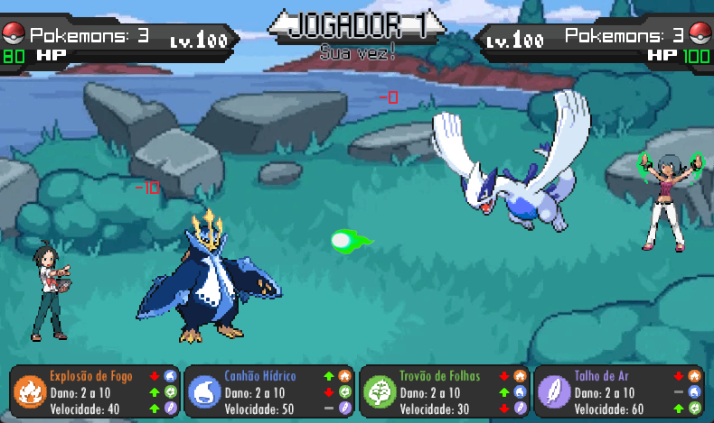
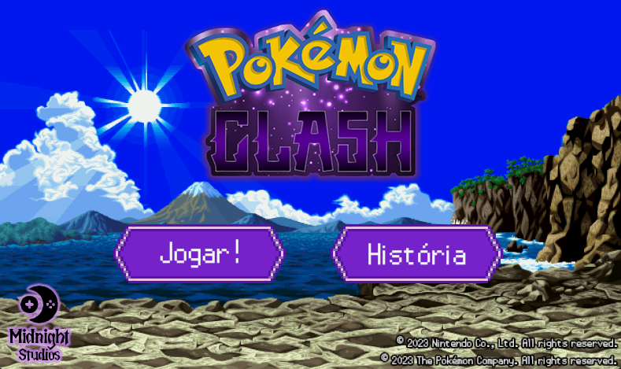
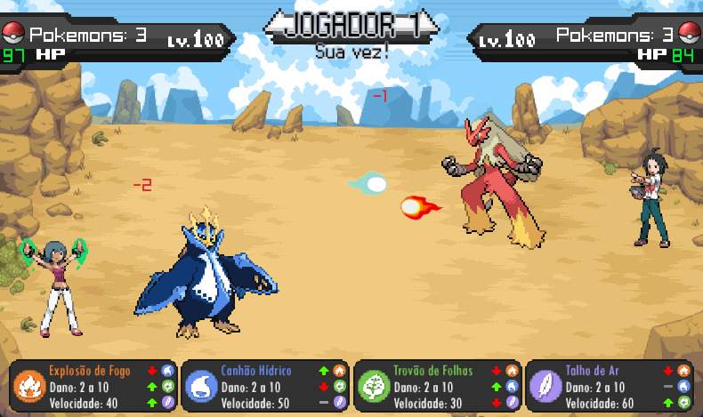
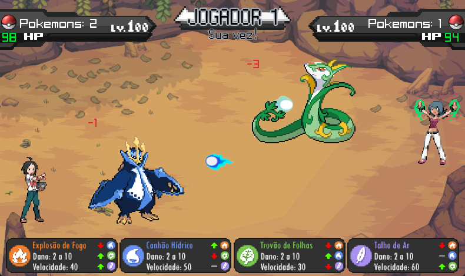

<h1 align="center">Pokémon Clash</h1>

A 1-on-1 battle game made in the C language, using the "raylib" library, as a college project for Faculdade de Tecnologia de Americana.
 

This is the repository for the complete source codes and assets used in the game. You can use it for free to learn, research, modify or improve the game. The limit is your imagination!

 

<a href="https://leonardont.itch.io/" target="_blank">Check this game at itch.io here!</a>

 

 

<h3 align="center">Welcome to Pokémon Clash!</h3>
 
<h4 align="center">Cheren and Sabrina, trainers from the regions of Unova and Kanto, are the newest competitors in the Pokémon Clash world tournament, located in the region of Brazi, a south-american tropical paradise. These two trainers are eager to climb their way up into the rankings and become the very best like no one ever was.</h4>
<h4 align="center">Battle against your friends, family or strangers in this fun two-player Pokémon battle game!</h4>

 

 

Click the <b>attack buttons</b> shown at the bottom of your screen to attack your opponent.

Each attack has its weaknesses and strengths. For example...

<h4 align="center">Fire wins against grass and air. Why?</h4>

Fire burns leaves, and makes a big fire tornado if it encounters a big air gust!

<h4 align="center">Water wins against fire. Why?</h4>

If it's not as clear as ice...

<h4 align="center">Grass wins against water. Why?</h4>

Trees grow when you water them. This should be enough explaining!

<h4 align="center">Air wins against grass. Why?</h4>

Annoying leaves hit your face when you're around a gale.

 

  

  

  

<h3 align="center"><b>Credits</b></h3>

 

<h3 align="center"><i><b>Music</b></i></h3>

"Title Theme" from Pokémon™ Scarlet & Violet Original Soundtrack by Game Freak Co., Ltd.

"Battle! Team Aqua Archie & Team Magma Maxie" from Pokémon™ Ultra Sun & Ultra Moon Original Soundtrack by Game Freak Co., Ltd.

"Battle! Clan Warden" from Pokémon™ Legends: Arceus Original Soundtrack by Game Freak Co., Ltd.

"Battle! Team Galactic Grunt" from Pokémon™ Brilliant Diamond & Shining Pearl Original Soundtrack by ILCA, Inc.

"Battle! Trainer" from Pokémon™ Sun & Moon Original Soundtrack by Game Freak Co., Ltd.

"Battle! Team Skull Grunt" from Pokémon™ Sun & Moon Original Soundtrack by Game Freak Co., Ltd.

"Battle! Lake Guardians" from Pokémon™ Brilliant Diamond & Shining Pearl Original Soundtrack by ILCA, Inc.

 

<h3 align="center"><i><b>Artwork</b></i></h3>

Pokémon™ (Nintendo Co., Ltd - All Rights Reserved)

Blaziken© (Nintendo Co., Ltd - All Rights Reserved)

Empoleon© (Nintendo Co., Ltd - All Rights Reserved)

Ho-Oh© (Nintendo Co., Ltd - All Rights Reserved)

Lugia© (Nintendo Co., Ltd - All Rights Reserved)

Sceptile© (Nintendo Co., Ltd - All Rights Reserved)

Serperior© (Nintendo Co., Ltd - All Rights Reserved)

Blaziken© (Nintendo Co., Ltd - All Rights Reserved)

Cheren© (Nintendo Co., Ltd - All Rights Reserved)

Sabrina© (Nintendo Co., Ltd - All Rights Reserved)

Staryu© (Nintendo Co., Ltd - All Rights Reserved)

Starmie© (Nintendo Co., Ltd - All Rights Reserved)

 

<h3 align="center"><i><b>Project</b></i></h3>

<b>Project Director, C Developer, raylib Developer, Digital Artist, Storyboard Creator</b>

Leonardo Nabarro Tonezer

<b>C Developer, raylib Developer</b>

Mileny Fernanda de Souza Clemente

 

 

<h4 align="center">DISCLAIMER: "Pokémon Clash" is a personal project, developed for the "Advanced Programming" subject, coded "ILP202", at Faculdade de Tecnologia de Americana (FATEC-AM), located in Americana, São Paulo, Brazil.<h4>
<h4 align="center">This project does NOT comercially profit today, has NOT comercially profited in the past, and will NOT comercially profit in the future.</h4>
<h4 align="center">The owners and participants of this project do not sell, endorse the selling or receive any money for the copies of this project, strictly because there is copyrighted material from third parties developed into it.</h4>
 
<h4 align="center">THE HEREBY PROJECT SHALL BE USED ONLY AND EXCLUSIVELY FOR RESEARCH PURPOSES.</h4>

 

 

<h3 align="center">Copyright © 2023 Leonardo Nabarro Tonezer & Mileny Fernanda de Souza Clemente</h3>
<h3 align="center">Apache License - Version 2.0</h3>
